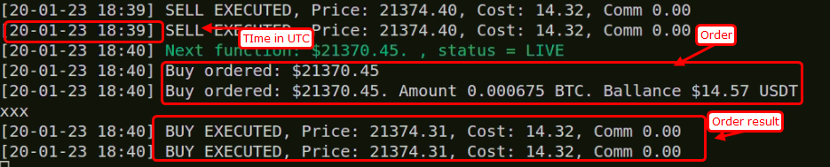

# Backtrader Binance Bot

Using simple BUY/ORDER strategy on Binance with backtrader.

## Installation

Use ubuntu linux system, if possible

Activating [Virtualenv](https://virtualenv.pypa.io/en/latest/)

```
make init
source venv/bin/activate
```

Installing dependencies

```
make install
```

Start application

```
./main.py
```

## Strategy

Used simple strategy to BUY/SELL on every turn. File is back_rsi.py

## Configuration

In config.py, you have to set binance account info.

## Results


